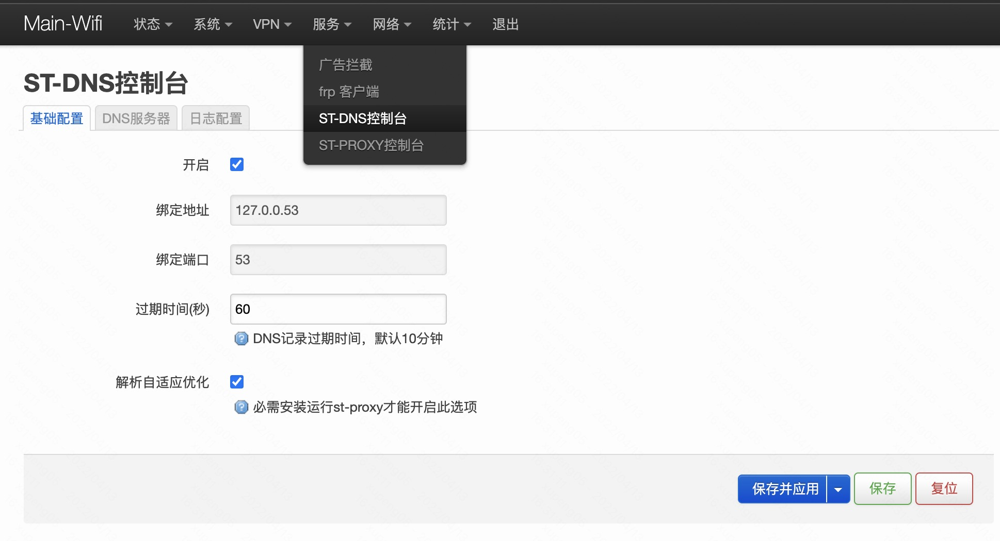

## What is st-dns?  
st-dns is a smart local dns server which support to config multi UDP/TCP/DOT DNS server chain. every dns server support limit to resolve specific area IP, so as you config proper, it can smart resolve the IP you want.  

### Dependencies
- [CMake](https://cmake.org/) >= 3.7.2
- [Boost](http://www.boost.org/) >= 1.66.0 (system,filesystem,thread regex)
- [OpenSSL](https://www.openssl.org/) >= 1.1.0
- [Curl](https://github.com/curl/curl)

### How to install?  
#### for all platform  
1. download the source code
2. execute ```install.sh```
3. the st-dns will install to /usr/local/bin, the default configs will install to /usr/local/etc/st/dns
#### for openwrt 
1. add openwrt feeds https://github.com/codingdie/openwrt-packages 
2. choose luci-app-st-dns and install
3. the app like this

### How to run?  
#### 1. Run Direct  
*  `st-dns` search config in /etc/st/dns or /usr/local/etc/st/dns
*  `st-dns  -c /xxx/xxx`  specific the config folder
#### 2. Run As Service(Recommend)
*  `sudo st-dns -d start`  
*  `sudo st-dns -d stop`  

### How to config?  
```jsonc
{
    "ip": "127.0.0.1", //local IP to bind
    "port": "53", //local port to bind
    "servers": [ //dns server chain
        {
            "type": "UDP", //dns server type supprot UDP/TCP/TCP_SSL
            "ip": "192.168.31.1", //dns server IP
            "port": 53, //dns server port
            "areas": [ //dns record area
                "LAN"
            ],
            "timeout": "500", //dns query timeout
            "dns_cache_expire": 60 //dns record expire(second)
        },
        {
            "type": "TCP_SSL",
            "ip": "223.5.5.5",
            "port": 853,
            "areas": [
                "CN"
            ],
            "timeout": "1000",
            "dns_cache_expire": 600
        },
        {
            "type": "TCP_SSL",
            "ip": "8.8.8.8",
            "port": 853,
            "areas": [
                "JP",
                "US",
                "HK",
                "TW",
                "!CN"
            ],
            "timeout": "20000",
            "dns_cache_expire": 600
        }
    ],
    "dns_cache_expire": 60, //client dns cache time(second)
    "area_resolve_optimize": false, //open it when st-proxy is running, it can help resolve better ip
    "log": {
        "level": 1, //0-3 DEBUG/INFO/WARN/ERROR
        "raw_log_server": { //UDP log server for raw log (optional), recommend logstash to elasticseatch
            "ip": "192.168.31.20", //server ip
            "port": 30500, //server port
            "tag": "st-proxy" //fixed value
        },
        "apm_log_server": { //UDP log server for apm log (optional), recommend logstash to elasticseatch
            "ip": "192.168.31.20",
            "port": 30501,
            "tag": "st-proxy" //fixed value
        }
    }
}
```

     

